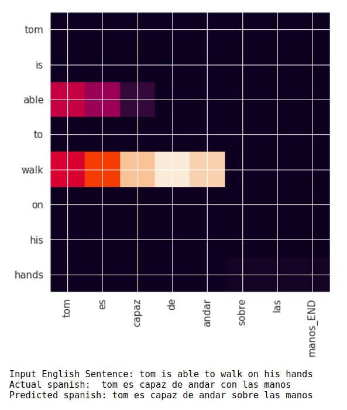
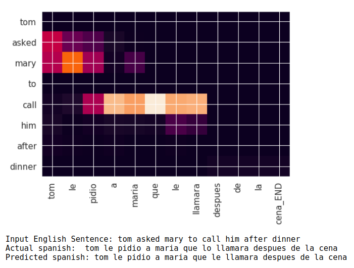
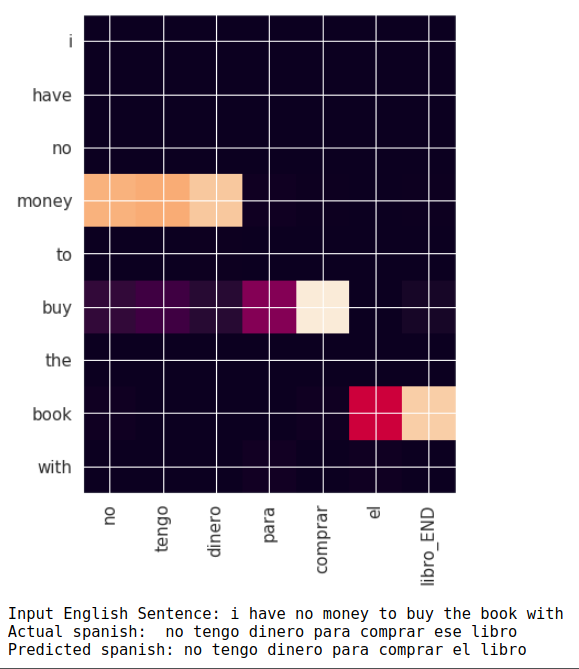
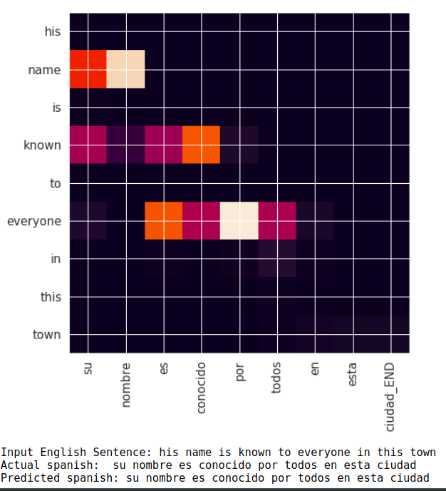
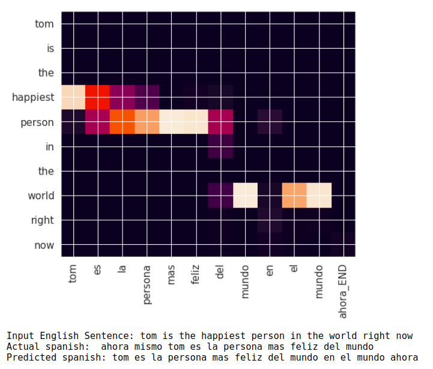
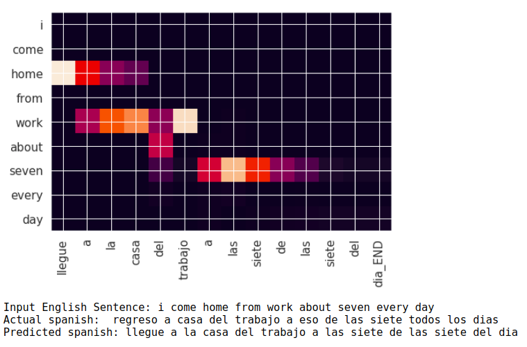

# Neural-Machine-Translation

### Dataset

German - English translation dataset is downloaded from [Tab-delimited Bilingual Sentence Pairs](http://www.manythings.org/anki/).

First a [CSV file](dataset/english-spanish-dataset.csv) generated using `preprocess.py` for easy management and access.

During training, dataset is divided randomly in 7:3 ratio.

### Embeddings

The embedding layer of the network is initialized first with pre-trained embedding trained using Word2Vec (skipgram model) on [english-spanish-dataset.csv](dataset/english-spanish-dataset.csv) to improve the overall performance of the network.

You can find trained embedding under "RELEASES" section.

## LSTM-Attention Model

### Architecture

Here a simple model with Luong's Attention is used to achieve the task of language translation although more complex models can be built to improve the model's performance. You can read more about basics and backgrounds of NMTs at [tensorflow/nmt](https://github.com/tensorflow/nmt#basic).

I attempt to implement [Luong's attention](https://arxiv.org/pdf/1508.04025.pdf) due to its simplicity in understanding as well as implementation.

This diagram explains the basic architecture of the model [Source: [background-on-the-attention-mechanism](https://github.com/tensorflow/nmt#background-on-the-attention-mechanism)]:
<p align="center">  </p>


### Code

#### Preprocessing

Dataset from [Tab-delimited Bilingual Sentence Pairs](http://www.manythings.org/anki/) is in the format of text file with language1-lagnuage2 seperated by `\t` (tab). For better management, I have opt to create a `CSV` file. `preprocess.py` takes input the `.txt` (`spa.txt`) and cleans the file by converting non-printable characters to printable format and generates the `CSV` file.

```
usage: preprocess.py [-h] --dataset DATASET [--language_1 LANGUAGE_1]
                     --language_2 LANGUAGE_2 [--save_file SAVE_FILE]

optional arguments:
  -h, --help            show this help message and exit
  --dataset DATASET, -d DATASET
                        Path to .txt file downloaded from
                        http://www.manythings.org/anki/
  --language_1 LANGUAGE_1, -l1 LANGUAGE_1
                        Language-1 name | Default: english
  --language_2 LANGUAGE_2, -l2 LANGUAGE_2
                        Language-2 name
  --save_file SAVE_FILE, -s SAVE_FILE
                        Name of CSV file to be generated | Default:
                        dataset.csv

```

#### Generating Embeddings

You can generate word2vec embeddings using `generate_embeddings.py` on your own dataset.
```
usage: generate_embeddings.py [-h] --csv CSV --language LANGUAGE [--sg]
                              [-emb_size EMB_SIZE] [--save_file SAVE_FILE]

optional arguments:
  -h, --help            show this help message and exit
  --csv CSV             Path to CSV which is to be read
  --language LANGUAGE, -l LANGUAGE
                        Language whose embedding is to be generated from CSV
                        file. (It should be the column name in CSV)
  --sg                  Whether to use SkipGram or CBoW model | Default: CBoW
  -emb_size EMB_SIZE, -s EMB_SIZE
                        Size of embedding to generate | Defualt: 256
  --save_file SAVE_FILE
                        Name of embedding file to save | Default:
                        [skipgram/cbow]-[language]-[embedding_size].model

```

You are now ready to train the model.

#### Training the Model

Fire-up Jupyter-Notebook and open `NMT-Training-Inference.ipynb` IPython notebook.

Feel free to alter the default values and play with the code.

Run all the cells and the logs and trained weights are saved under `log_dir` (Default: `eng-spa-weights`)

You can also run `tensorboard` to monitor the train-vs-val loss. The weights and tensorboard logs will be saved in `log_dir`.


#### Inference

Jupyter-Notebook also contains sample translations generated by the trained NMT model. Along with the translation, Attention plot are also plotted to understand how attention works here.

Here are some samples:

 - <p align="center">  </p>

Translation of the output Sentence: Tom is able to walk on his hands


 - <p align="center">  </p>

Translation of the output Sentence: Tom asked Maria to call him after dinner


 - <p align="center">  </p>

Translation of the output Sentence: I do not have money to buy the book


- <p align="center">  </p>

Translation of the output Sentence: his name is known by everyone in this city


 - <p align="center">  </p>

Translation of the output Sentence: Tom is the happiest person in the world in the world now


 - <p align="center">  </p>

Translation of the output Sentence: arrive at the house of work at seven o'clock seven o'clock


As we can see from these samples, the model is not highly accurate, but gives considerable good results. Adding `Attention Layer` to the architecture has definetly improved the model's performance.
